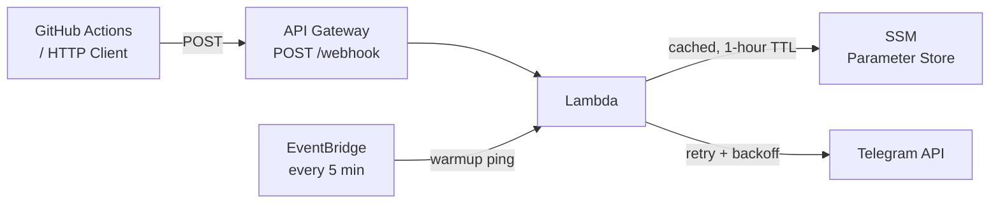

# Telegram Notify Bot

Serverless Telegram bot for sending notifications via AWS Lambda.

## Architecture



- **API Gateway** receives POST webhooks and forwards to Lambda
- **Lambda** fetches config from SSM Parameter Store (cached in-memory, 1-hour TTL) and sends messages via Telegram API with retry/backoff
- **EventBridge** pings Lambda every 5 minutes to keep it warm (eliminates cold starts)
- **SSM Parameter Store** stores bot token and chat IDs (encrypted at rest)

## Prerequisites

- [Telegram Bot Token](https://t.me/botfather) (create with @BotFather)
- AWS account with CLI configured
- [OpenTofu](https://opentofu.org) v1.6+
- Node.js 24+
- S3 bucket for OpenTofu state

## Environment Variables

### OpenTofu Variables (`terraform.tfvars`)

| Variable | Required | Description | Example |
|----------|----------|-------------|---------|
| `aws_region` | Yes | AWS region for deployment | `eu-central-1` |
| `aws_profile` | No | AWS CLI profile (optional, uses default if empty) | `my-sso-profile` |
| `terraform_state_bucket` | Yes | S3 bucket name for OpenTofu state | `my-terraform-state` |
| `telegram_bot_token` | Yes | Bot token from @BotFather | `123456789:ABCdef...` |
| `telegram_admin_chat_id` | Yes | Admin Telegram chat ID | `12345678` |
| `telegram_chat_ids` | No | Additional authorized chat IDs (comma-separated) | `-100123,-100456` |
| `project_name` | Yes | Project identifier | `telegram-notify-bot` |
| `lambda_reserved_concurrency` | No | Max concurrent Lambda executions (default: 10) | `10` |

### GitHub Actions Secrets

| Variable | Required | Description | Example |
|----------|----------|-------------|---------|
| `AWS_REGION` | Yes | AWS region for deployment | `eu-central-1` |
| `TERRAFORM_STATE_BUCKET` | Yes | S3 bucket name for OpenTofu state | `my-terraform-state` |
| `TELEGRAM_BOT_TOKEN` | Yes | Bot token from @BotFather | `123456789:ABCdef...` |
| `TELEGRAM_CHAT_ID` | Yes | Your Telegram chat ID | `12345678` |
| `TELEGRAM_API_URL` | Yes | Telegram API base URL | `https://api.telegram.org` |
| `TERRAFORM_ROLE` | Yes* | IAM role ARN for OIDC authentication | `arn:aws:iam::123456789:role/...` |

\* Using OIDC authentication (recommended). Alternatively, you can use `AWS_ACCESS_KEY_ID` and `AWS_SECRET_ACCESS_KEY` for key-based auth.

## Quick Setup

### 1. Create Telegram Bot
- Message [@BotFather](https://t.me/botfather) on Telegram
- Send `/newbot` and follow instructions
- Save your bot token

### 2. Get Your Chat ID
- Message your new bot
- Visit: `https://api.telegram.org/bot<YOUR_TOKEN>/getUpdates`
- Find your chat ID in the response

### 3. Configure OpenTofu
Create `terraform/terraform.tfvars`:
```hcl
aws_region             = "eu-central-1"
aws_profile            = ""  # Optional
terraform_state_bucket = "your-terraform-state-bucket"
telegram_bot_token     = "123456789:your_bot_token_here"
telegram_admin_chat_id = "your_chat_id_here"
project_name           = "telegram-notify-bot"
```

### 4. Deploy
```bash
npm install
cd terraform

# Create backend config
cat > backend.hcl << EOF
bucket = "$(grep terraform_state_bucket terraform.tfvars | cut -d'"' -f2)"
region = "$(grep aws_region terraform.tfvars | cut -d'"' -f2)"
EOF

tofu init -backend-config=backend.hcl
tofu apply
```

## Usage

Send notifications via HTTP POST:
```bash
curl -X POST "https://your-api-url/webhook" \
  -H "Content-Type: application/json" \
  -d '{"chat_id": "YOUR_CHAT_ID", "message": {"text": "Deployment completed!"}}'
```

## Development

```bash
npm run build              # Build TypeScript
npm run dev                # Watch mode
npm run tofu:deploy        # Deploy infrastructure
```

## GitHub Actions CI/CD

The project includes automated deployment. To set up:

1. Copy the example environment file:
   ```bash
   cp .env.example .env
   ```

2. Fill in your values in `.env`

3. Add the same secrets to your GitHub repository settings (`Settings` -> `Secrets and variables` -> `Actions`)

**Choose one authentication method:**
- **Option A:** Set `AWS_ACCESS_KEY_ID` and `AWS_SECRET_ACCESS_KEY`
- **Option B (recommended):** Set `TERRAFORM_ROLE` with IAM role ARN for OIDC

**Always required:**
- `TERRAFORM_STATE_BUCKET` - S3 bucket for OpenTofu state
- `TELEGRAM_BOT_TOKEN` - Your bot token
- `TELEGRAM_CHAT_ID` - Your chat ID
- `AWS_REGION` - AWS region
- `TELEGRAM_API_URL` - Telegram API URL

**Built with ❤️ by [Domen Gabrovšek](https://github.com/domengabrovsek)**
