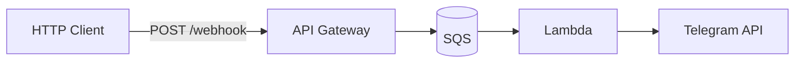

# Telegram Notify Bot

Serverless Telegram bot for sending notifications. Receives messages via an HTTP webhook, buffers them through SQS, and delivers them via the Telegram Bot API. Deployed to AWS with OpenTofu.

## Architecture


```mermaid
flowchart LR
    Caller[HTTP Client]
    APIGW[API Gateway]
    SQS[(SQS)]
    Lambda[Lambda]
    Telegram[Telegram API]

    Caller -- POST /webhook --> APIGW
    APIGW --> SQS
    SQS --> Lambda
    Lambda --> Telegram
```

API Gateway receives webhooks and forwards them to an SQS queue. Lambda processes messages from the queue with retry logic and exponential backoff. A dead letter queue captures messages that fail after 3 attempts. EventBridge pings Lambda every 5 minutes to avoid cold starts.

## Quick Start

```bash
npm install
npm run build
cd terraform
tofu init -backend-config=backend.hcl
tofu apply
```

See [docs/setup.md](docs/setup.md) for the full setup guide.

## Usage

Send notifications via HTTP POST:

```bash
curl -X POST "https://your-api-url/webhook" \
  -H "Content-Type: application/json" \
  -d '{"chat_id": "YOUR_CHAT_ID", "message": {"text": "Deployment completed!"}}'
```

## Development

```bash
npm run build        # Build Lambda bundle
npm run dev          # Watch mode
npm run test         # Run tests
npm run typecheck    # TypeScript type check
npm run lint         # Biome lint & format check
npm run lint:fix     # Auto-fix lint issues
npm run tofu:init    # Initialize OpenTofu backend
npm run tofu:plan    # Preview infrastructure changes
npm run tofu:apply   # Deploy infrastructure
npm run tofu:destroy # Tear down infrastructure
```

## Documentation

- [Architecture](docs/architecture.md) - system design, AWS resources, IAM requirements
- [Configuration](docs/configuration.md) - OpenTofu variables, GitHub Actions secrets
- [Setup](docs/setup.md) - prerequisites, Telegram bot creation, deployment steps
- [CI/CD](docs/ci-cd.md) - GitHub Actions workflows, authentication setup

## License

MIT - [Domen Gabrovsek](https://github.com/domengabrovsek)
