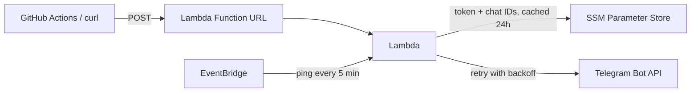

# telegram-notify-bot 🤖

Sends me a Telegram message when something in my repos needs attention. One Lambda behind a public Function URL: POST a chat ID and some text, it forwards to the Telegram Bot API. The notification workflows in [domengabrovsek/github-actions](https://github.com/domengabrovsek/github-actions) are its main caller.

## How it works


```mermaid
flowchart LR
    Caller[GitHub Actions / curl]
    URL[Lambda Function URL]
    Lambda[Lambda]
    SSM[SSM Parameter Store]
    Telegram[Telegram Bot API]
    EB[EventBridge]

    Caller -- POST --> URL
    URL --> Lambda
    Lambda -- token + chat IDs, cached 24h --> SSM
    Lambda -- retry with backoff --> Telegram
    EB -- ping every 5 min --> Lambda
```

The Function URL is unauthenticated at the edge because Telegram cannot sign its webhook calls. Authorization happens in the handler instead: only chat IDs on the allowlist get a message delivered, everything else is dropped and the admin chat gets an alert with the caller's details. Bot token and chat IDs live in SSM as encrypted parameters, read once per container and cached for 24 hours.

The same endpoint takes both kinds of traffic: Telegram webhook updates (registered automatically on deploy) and direct API calls from CI. Webhook updates are never echoed back, so messaging the bot does nothing except trip an alert if you are not on the allowlist.

## Sending a message

```bash
curl -X POST "$WEBHOOK_URL" \
  -H "Content-Type: application/json" \
  -d '{"chat_id": "123456789", "message": {"text": "Deploy finished"}}'
```

Plain text only, 4096 characters max. The endpoint always answers `200` so Telegram does not queue retries, which means a rejected or failed send shows up in CloudWatch, not in the response. Telegram 429s and 5xx are retried twice with exponential backoff.

## Deploying

You need an AWS account, [OpenTofu](https://opentofu.org) 1.6+, Node 24, an S3 bucket for state, and a bot token from [@BotFather](https://t.me/botfather).

```bash
npm install
npm run build                                   # dist/index.mjs is what OpenTofu zips
cd terraform
cp terraform.tfvars.example terraform.tfvars    # bot token, chat IDs, state bucket
cp backend.hcl.example backend.hcl              # state bucket + region
tofu init -backend-config=backend.hcl
tofu apply                                      # also calls setWebhook with the new URL
```

`tofu apply` prints the Function URL as a sensitive output (`tofu output webhook_url`). Deploys also run from GitHub Actions on push to `main`. Full walkthrough, including how to find your chat ID: [docs/setup.md](docs/setup.md).

## Scripts

```bash
npm run build        # bundle the Lambda with vite
npm run dev          # rebuild on change
npm run test         # vitest
npm run typecheck    # tsc --noEmit
npm run lint         # biome check
npm run lint:fix     # biome check --write
npm run tofu:plan    # preview infrastructure changes
npm run tofu:apply   # deploy
npm run tofu:destroy # tear it all down
```

## Docs

- [Architecture](docs/architecture.md) - AWS resources, IAM, request flow
- [Configuration](docs/configuration.md) - OpenTofu variables, GitHub Actions secrets
- [Setup](docs/setup.md) - bot creation, chat ID, first deploy
- [CI/CD](docs/ci-cd.md) - workflows and OIDC authentication

## License

MIT - [Domen Gabrovsek](https://github.com/domengabrovsek)
