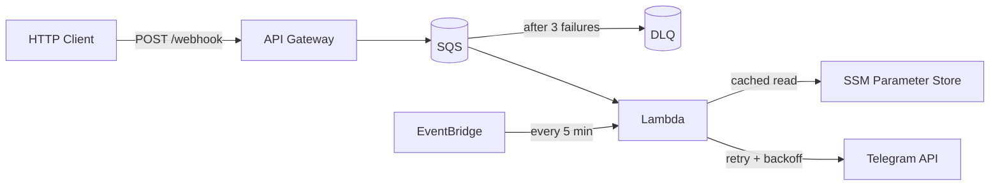

# Architecture

## Components

- **API Gateway** - receives POST webhooks, throttled at 20 req/s with 40 burst, forwards to SQS
- **SQS Queue** - buffers incoming messages, prevents failures during burst traffic (e.g. concurrent GitHub Actions)
- **SQS Dead Letter Queue** - captures messages that fail 3 times, retained for 14 days
- **Lambda** - fetches config from SSM (cached in-memory, 24-hour TTL), sends messages via Telegram API with retry and exponential backoff
- **EventBridge** - pings Lambda every 5 min to avoid cold starts
- **SSM Parameter Store** - stores bot token and chat IDs (encrypted at rest)
- **CloudWatch Logs** - error-only logging with 7-day retention

## AWS Resources Created

| Resource | Description |
|----------|-------------|
| Lambda function | Handles webhook requests and sends Telegram notifications |
| IAM role + policies | Lambda execution role with SSM read, KMS decrypt, and SQS consume access |
| API Gateway REST API | Webhook endpoint (`POST /webhook`) with request validation |
| API Gateway stage | Production stage with throttling and error-only logging |
| SQS queue | Buffers incoming webhook messages for Lambda processing |
| SQS dead letter queue | Stores messages that fail processing after 3 attempts |
| IAM role (API GW -> SQS) | Allows API Gateway to send messages to SQS |
| SSM parameters (x3) | Bot token, admin chat ID, additional chat IDs |
| CloudWatch log group | Lambda logs with 7-day retention |
| EventBridge rule | Pings Lambda every 5 min to avoid cold starts |

## Deployment IAM Requirements

The GitHub Actions deployment role needs permissions for: Lambda, API Gateway, IAM, SSM, KMS, SQS, CloudWatch Logs, EventBridge, S3 (state), and STS.
